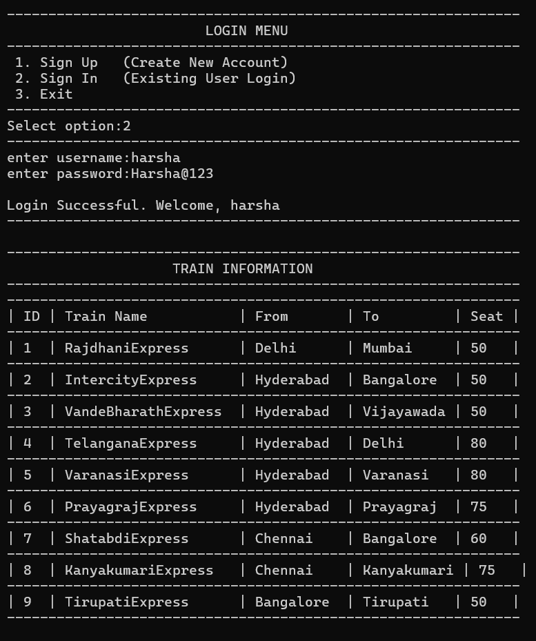
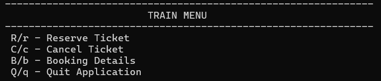
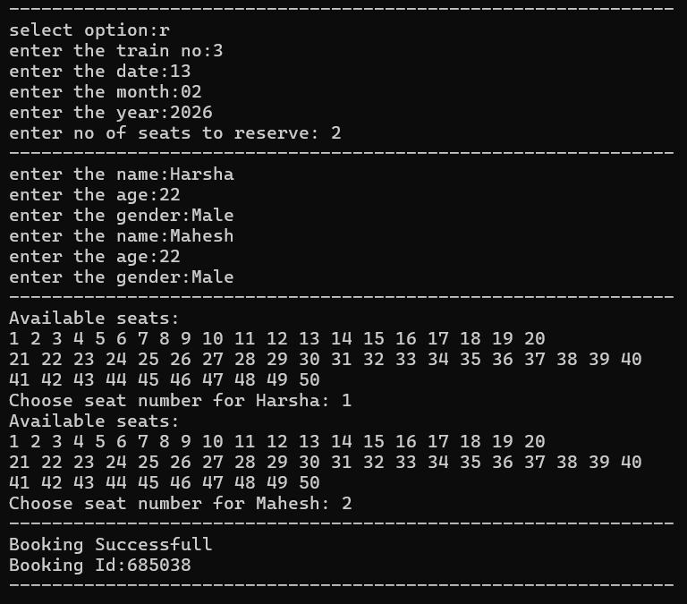
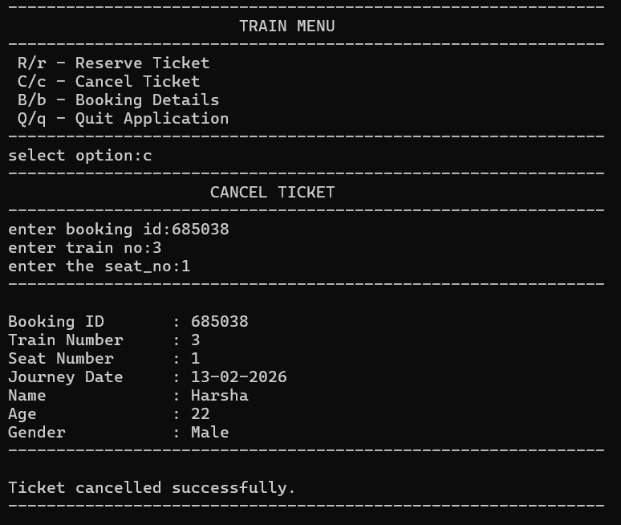

# 🚆 MYIRCTC – Train Reservation System (C)

MYIRCTC is a console-based Train Reservation System developed in C, inspired by core IRCTC functionality.  
The project demonstrates modular C programming, file handling,and linked list management.

---

## ✨ Highlights

- Modular multi-file C project
- Linked list–based passenger management
- File-based persistent storage
- Makefile-based build system
- Clean console interface

---

## 📌 Project Overview

The system allows users to:

- 🔐 Sign Up & Login
- 🚆 View Available Trains
- 🎟 Reserve Tickets
- ❌ Cancel Tickets
- 📋 View Booking Details

All data is stored in text files, and passenger records are managed dynamically using singly linked lists.

---

## 🚀 Features

- User Authentication
- Train Availability Check
- Ticket Reservation with Seat Allocation
- Ticket Cancellation
- Booking History Display
- Persistent File Storage
- Automated Build Verification

---

## 🛠 Tech Stack

- Language: C
- Concepts:
  - Structures
  - Pointers
  - File Handling
  - Linked Lists
  - Modular Programming
- Build Tool: Makefile


---


## 📁 Project Structure

```
myirctc/
├── main.c
├── login_menue.c
├── train_menue.c
├── sign_up.c
├── sign_in.c
├── reserve_ticket.c
├── cancel_ticket.c
├── booking_details.c
├── print_train_info.c
│
├── train.h
├── myheader.h
├── credintials.h
│
├── makefile
├── passengers_info.txt
├── usr_logins.txt
├── all_train_info.txt
│
└── .github/
    └── workflows/
        └── main.yml
```

---

## ▶️ How to Compile and Run

### 1️⃣ Clone the repository
```bash
git clone https://github.com/nallavelliharshavardhan/myirctc.git
cd myirctc
```
### 2️⃣ Build the project
```bash
make
```
### 3️⃣ Run the application
```bash
./myirctc

```
---
## 📸 Screenshots

### 🔐 Login Menu


### 🆕 Sign Up


### 🔑 Sign In



### 🎟 Ticket Reservation




### 📋 Booking Details


### ❌ Cancel Ticket


### 🚪 Exit Application


---


## 📚 Learning Outcomes

- Designing modular C applications  
- Implementing linked lists  
- File-based data persistence  
- Writing and using Makefiles  
- Debugging linker and build errors  

---

## 🔮 Future Improvements
 
- 🗄 Database integration (SQLite / MySQL)  
- 🌐 Web-based deployment  
- 📱 Email / SMS notifications  
- 🧭 Advanced booking rules  
- ⚙ Code refactoring and optimization  


---
## 🎓 Academic Context

This project was developed as part of academic coursework to apply theoretical concepts of **C programming** in a practical, real-world scenario.  
It emphasizes structured program design, modular development, and effective use of **data structures and file handling**.

The system was implemented to strengthen understanding of:
- Modular C programming practices  
- Use of structures and pointers  
- Implementation of singly linked lists  
- File-based data persistence  
- Build automation using Makefiles  
- Version control and CI using GitHub Actions  

The project serves as a comprehensive demonstration of core programming principles taught in undergraduate engineering curriculum.

---

##  👨‍💻Developed By

**Nallavelli Harshavardhan**  
Embedded Systems Trainee | ECE Graduate


---

## 📄 License

This project is developed for **educational purposes only**.
